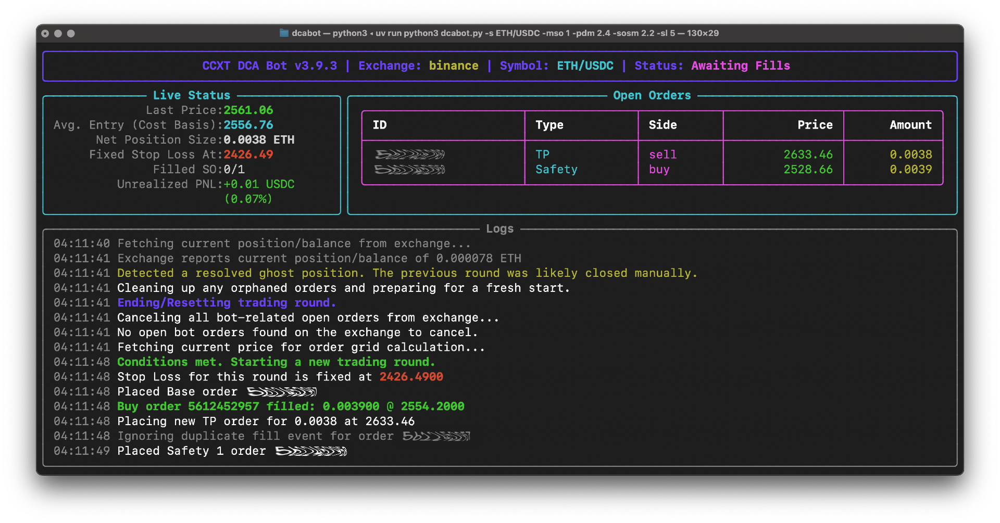
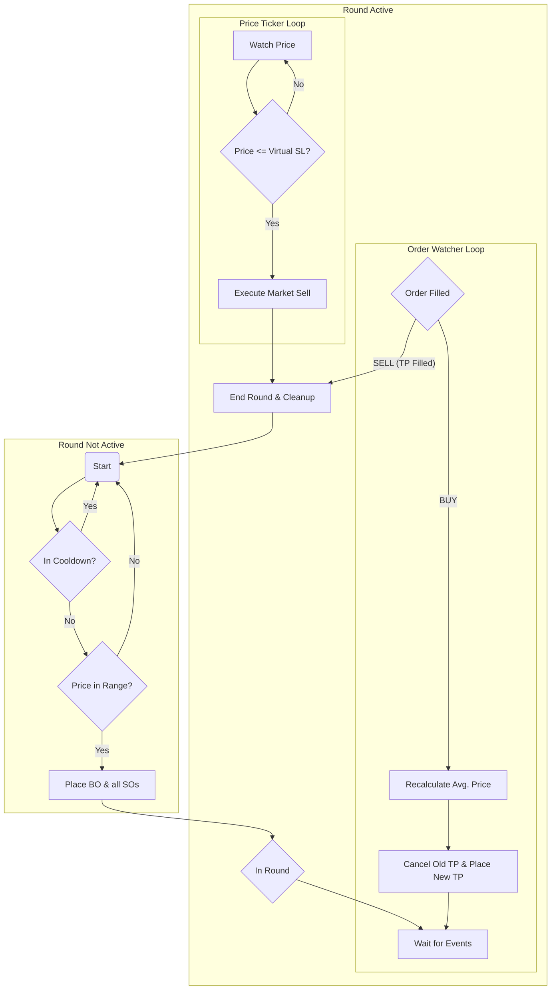

# DCABot: Crypto DCA Trading Bot 🤖

[](https://www.python.org/downloads/)
[](https://opensource.org/licenses/MIT)
[](https://ccxt.com)
[](https://github.com/Textualize/rich)



**DCABot** is a powerful, interactive, and resilient command-line tool for executing Dollar-Cost Averaging (DCA) trading strategies on a wide range of cryptocurrency exchanges. Built with `ccxt.pro` for real-time WebSocket connectivity and `rich` for a beautiful terminal interface, it's designed for both novice and experienced traders who prefer a terminal-based workflow.

It operates on both **spot** and **futures** markets and includes critical safety features like pre-run validation, fee-aware accounting, and a robust state recovery mechanism that makes it suitable for live trading environments.

## ✨ Key Features

- 🖥️ **Interactive Terminal UI:** A clean, live-updating dashboard shows your bot's status, open orders, real-time P&L, and logs at a glance.
- ✅ **Pre-run Confirmation & Validation:** Before a single order is placed, the bot presents a detailed, profit-aware trade plan and performs sanity checks on your strategy to prevent logical errors.
- 🔄 **Robust State Recovery:** The bot is resilient. If it crashes or is restarted, it automatically fetches its order history to reconstruct its state. It intelligently detects inconsistencies between its history and your actual balance, halting with clear instructions if manual intervention is required.
- 🛡️ **Production-Grade Safety:**
  - **Self-Contained Asset Management:** The bot only ever trades the assets it acquires _during a trading round_, preventing it from accidentally selling your long-term holdings.
  - **Safety Stops:** Halts automatically if state becomes inconsistent, preventing dangerous trades.
  - **OCO Emulation:** Manages Take Profit and Stop Loss safely on exchanges without native OCO support.
  - **Graceful Shutdown:** Correctly handles `Ctrl+C` to shut down cleanly without leaving orphaned processes.
- ⚙️ **Highly Configurable Strategy:** Fine-tune every aspect of your DCA strategy, including order sizes, price deviations, multipliers, take profit, and stop loss, directly from the command line.
- 🌐 **Broad Exchange Support:** Powered by CCXT, it can be configured to work with hundreds of cryptocurrency exchanges.

## 📸 In Action

First, the bot presents a detailed plan with profit projections and asks for your confirmation:

```text
╭─────────────────────────────────── Bot Run Configuration ────────────────────────────────────────╮
│                                                        Base Order Size:  10.0 (default)          │
│                                                Cooldown Between Rounds:  60 (default)            │
│                                                            Exchange Id:  binance (default)       │
│                                                               Fee Rate:  0.1000% (from exchange) │
│                                                      Max Safety Orders:  1                       │
│                                           Safety Order Size Multiplier:  2.2                     │
│                                                              Stop Loss:  5.0                     │
│                                                             ...and so on...                      │
╰──────────────────────────────────────────────────────────────────────────────────────────────────╯
╭──────────────────────────────────  Chronological Trade Plan  ──────────────────────────────────╮
│ ╭───────────────────┬───────────┬────────────┬───────────┬──────────────┬────────────────────╮ │
│ │ Order             │     Price │ Avg. Price │ Deviation │         Size │       P/L on Event │ │
│ ├───────────────────┼───────────┼────────────┼───────────┼──────────────┼────────────────────┤ │
│ │ TP (after Base)   │   2638.02 │            │           │   0.0039 ETH │         +0.29 USDC │ │
│ │ TP (after SO01)   │   2624.76 │            │           │   0.0078 ETH │         +0.58 USDC │ │
│ │ Base Order        │   2558.62 │    2561.18 │     0.00% │  10.00 USDC  │          0.00 USDC │ │
│ │ Safety Order 01   │   2533.03 │    2548.31 │     1.00% │  10.00 USDC  │         -0.14 USDC │ │
│ │ Stop Loss         │   2430.69 │            │     5.00% │   0.0078 ETH │         -0.94 USDC │ │
│ ╰───────────────────┴───────────┴────────────┴───────────┴──────────────┴────────────────────╯ │
╰────────────────────────────────────────────────────────────────────────────────────────────────╯
 P/L for buy orders shows the estimated unrealized loss if the position were sold immediately...

 Do you want to start the bot with this configuration? [y/n] (y):
```

Once confirmed, the bot switches to a live dashboard that keeps you informed in real-time:

```text
╭──────────────────────────────────────────────────────────────────────────────────────────────────╮
│              CCXT DCA Bot v3.9.4 | Exchange: binance | Symbol: ETH/USDC | Status: Awaiting Fills │
╰──────────────────────────────────────────────────────────────────────────────────────────────────╯
╭────────────── Live Status ──────────────╮╭────────────────── Open Orders ────────────────────────╮
│              Last Price:2553.72         ││ ╭──────────────────┬────────┬──────┬─────────┬───╮    │
│ Avg. Entry (Cost Basis):2556.76         ││ │ ID               │ Type   │ Side │   Price │...│    │
│       Net Position Size:0.0038 ETH      ││ ├──────────────────┼────────┼──────┼─────────┼───┤    │
│      Fixed Stop Loss At:2426.49         ││ │ 5612461259       │ TP     │ sell │ 2633.46 │...│    │
│               Filled SO:0/1             ││ │ 5612461258       │ Safety │ buy  │ 2528.66 │...│    │
│          Unrealized PNL:-0.02 USDC      ││ ╰──────────────────┴────────┴──────┴─────────┴───╯    │
│                         (-0.22%)        ││                                                       │
╰─────────────────────────────────────────╯╰───────────────────────────────────────────────────────╯
╭──────────────────────────────────────────── Logs ────────────────────────────────────────────────╮
│ 04:11:41 Detected a resolved ghost position. The previous round was likely closed manually.      │
│ 04:11:41 Cleaning up any orphaned orders and preparing for a fresh start.                        │
│ 04:11:48 Conditions met. Starting a new trading round.                                           │
│ 04:11:48 Stop Loss for this round is fixed at 2426.4900                                          │
│ 04:11:48 Buy order 5612461257 filled: 0.003900 @ 2554.2000                                       │
│ 04:11:48 Placing new TP order for 0.0038 at 2633.46                                              │
│ 04:11:49 Placed Safety 1 order 5612461258                                                        │
╰──────────────────────────────────────────────────────────────────────────────────────────────────╯
```

## 🛠️ Installation

### 1. Clone the Repository

```bash
git clone https://github.com/spilneo/dcabot.git
cd dcabot
```

### 2. Install Dependencies

The bot requires Python 3.8+. Using a virtual environment is highly recommended.

```bash
# Create and activate a virtual environment
python3 -m venv venv
source venv/bin/activate

# Install required packages
pip install "ccxt[async_support,pro]" rich rich-argparse
```

### 3. Configure API Keys

The bot loads your exchange API keys from a `keys.json` file. This keeps your secret credentials separate from the code.

1.  Create a file named `keys.json` in the same directory.
2.  Add your API key and secret. You can add configurations for multiple exchanges.

**`keys.json` Template:**

```json
{
  "binance": {
    "apiKey": "YOUR_BINANCE_API_KEY",
    "secret": "YOUR_BINANCE_SECRET"
  },
  "bybit": {
    "apiKey": "YOUR_BYBIT_API_KEY",
    "secret": "YOUR_BYBIT_SECRET"
  },
  "kucoin": {
    "apiKey": "YOUR_KUCOIN_API_KEY",
    "secret": "YOUR_KUCOIN_SECRET",
    "password": "YOUR_API_PASSPHRASE"
  }
}
```

> ⚠️ **Security Warning:**
>
> - Ensure your API keys have permissions for **reading info** and **trading** (spot and/or futures). For maximum security, **disable withdrawal permissions**.
> - **Never** commit your `keys.json` file to a public repository. The included `.gitignore` file should prevent this, but always double-check.

## 🏃‍♀️ Usage

Run the bot from your terminal using `python3 dcabot.py`.

### Examples

- **Simple Spot Trade:**

  ```bash
  python3 dcabot.py -s ETH/USDC
  ```

- **Complex Futures Trade:**

  ```bash
  python3 dcabot.py -s BTC/USDT:USDT -t futures -l 5 -bos 20 -sos 30 -sosm 1.5 -pdm 1.5 -mso 5 -tp 2.5 -sl 8
  ```

  > _Note: Symbol formats vary by exchange. For Binance spot, use `BTC/USDT`. For Binance USDT-M futures, use `BTC/USDT:USDT`. Check CCXT documentation for your specific exchange._

- **View All Commands:**
  ```bash
  python3 dcabot.py --help
  ```

### Command-Line Arguments

| Flag                                      | Default   | Description                                                                    |
| :---------------------------------------- | :-------- | :----------------------------------------------------------------------------- |
| **`Required`**                            |           |                                                                                |
| `-s`, `--symbol`                          | _None_    | Trading symbol (e.g., `BTC/USDT` for spot, `BTC/USDT:USDT` for futures).       |
| **`Strategy`**                            |           |                                                                                |
| `-t`, `--trade-type`                      | `spot`    | The type of market to trade on: `spot` or `futures`.                           |
| `-tp`, `--take-profit`                    | `3.0`     | **Dynamic** Take Profit percentage from the average cost-basis price.          |
| `-sl`, `--stop-loss`                      | `0.0`     | **Fixed** Stop Loss percentage from the round's **starting price**. 0=disable. |
| `-pd`, `--price-deviation`                | `1.0`     | Price deviation for the **first safety order** from the start price (%).       |
| `-pdm`, `--price-deviation-multiplier`    | `1.0`     | Multiplier for subsequent safety order price deviations.                       |
| **`Sizing (in Quote Currency)`**          |           |                                                                                |
| `-bos`, `--base-order-size`               | `10.0`    | Size of the base order in the quote currency (e.g., USDT).                     |
| `-sos`, `--safety-order-size`             | `10.0`    | Size of the first safety order in the quote currency.                          |
| `-sosm`, `--safety-order-size-multiplier` | `1.0`     | Multiplier for the size of subsequent safety orders.                           |
| `-mso`, `--max-safety-orders`             | `1`       | Maximum number of safety orders to place.                                      |
| **`Control`**                             |           |                                                                                |
| `--exchange-id`                           | `binance` | The ID of the exchange to use (from CCXT, e.g., 'bybit', 'kucoin').            |
| `--trigger-price`                         | _None_    | Price to start the first round (uses last market price if not set).            |
| `--lower-price-range`                     | _None_    | Only start a new round when the price is **above** this value.                 |
| `--upper-price-range`                     | _None_    | Only start a new round when the price is **below** this value.                 |
| `--cooldown-between-rounds`               | `60`      | Seconds to wait before starting a new round after one has closed.              |
| `--no-confirm`                            | `False`   | Skip the initial confirmation prompt and start the bot immediately.            |

## 🧠 Core Logic

### Self-Contained Asset Management

The bot's most important safety principle is that it **only manages assets it has acquired itself**. It meticulously tracks the cost and amount of every buy order within a single trading round. This ensures that a Take Profit or Stop Loss order will _only_ sell the position the bot built in that round, never touching other funds in your account.

### Dynamic Take Profit & Virtual Stop Loss (OCO Emulation)

The bot uses a hybrid approach to maximize profit while maintaining a clear risk limit. To ensure compatibility with all exchanges, it emulates an OCO (One-Cancels-the-Other) order.

1.  **Initial Orders:** At the start of a round, a `LIMIT BUY` Base Order (BO) and all Safety Orders (SO) are placed on the exchange.
2.  **Cost & Amount Tracking:** When a `BUY` order fills, the bot correctly accounts for the trade:
    - **Cost:** The amount of quote currency spent (`filled_amount * price`) is added to `position_cost`.
    - **Amount:** The amount of base currency received, _net of fees_ (`filled_amount * (1 - fee_rate)`), is added to `position_amount`.
3.  **Average Entry Price:** The true cost-basis average price is calculated: `Average Price = Total Cost / Total Net Amount`.
4.  **Dynamic Take Profit (TP):** The bot places a single `LIMIT SELL` order on the exchange for the `position_amount` it currently tracks. Each time a new `BUY` order fills, it cancels the old TP order and places a new one based on the updated average price (`new_avg_price * (1 + tp / 100)`). This allows the TP target to move down as you average into the position.
5.  **Virtual Stop Loss (SL):** The Stop Loss is **not** an order placed on the exchange. Instead, the bot monitors the price in its real-time ticker loop.
    - The SL price is fixed at the start of the round: `start_price * (1 - sl / 100)`.
    - If the live price drops to or below the SL price, the bot immediately cancels the open TP order and submits a `MARKET SELL` order for its tracked `position_amount` to exit the position safely.

This cycle continues until either the TP order is filled or the virtual SL is triggered, concluding the round.

### The Trading Cycle Flowchart



## ⚠️ Disclaimer

**This is not financial advice. Trading cryptocurrencies is highly risky.**

- You are solely responsible for any financial losses incurred by using this software.
- **Always** test the bot thoroughly with a `paper trading` or `testnet` account before using real funds. Exchange testnets are free and invaluable for safe testing.
- Software can have bugs. Do not risk funds that you are not prepared to lose.
- Ensure you understand the DCA strategy and the implications of every parameter before running the bot.

## 🗺️ Roadmap

- **Trailing Take Profit:** Implement logic for a trailing take profit to secure gains more effectively in a strong trend.
- **Advanced Entry Conditions:** Allow starting a new round based on technical indicators (e.g., RSI, MACD).
- **Web Interface:** A simple web dashboard for remote monitoring and control.
- **Multi-Symbol/Bot Management:** A central controller to run and manage multiple bot instances simultaneously.

## 📄 License

This project is licensed under the MIT License.
